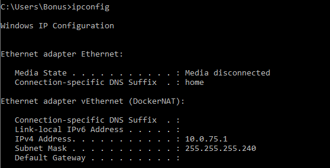

# enviorment
R&amp;D environment to get around complex installs and not being able to run output on Monitor / Display 

## Windows

 - Run x-server (Xming for example).
 - find out your IP


```
ipconfig
set DISPLAY=10.0.75.1:0.0
docker run -it --rm -p 8888:8888 -e DISPLAY=%DISPLAY% -v /tmp/.X11-unix:/tmp/.X11-unix
```


```

Stachlewski, Tomasz
Fri, Nov 22, 5:16 PM (11 days ago)
to me, Sandra, Marek

Hi Mathias,

As we discussed today on the call:

 

The way to quickly provision new resources (and then delete them) is to use CloudFormation – this is a script, which describe all the resources which you need, and then AWS automaticly creates all of them which are described in the file. For example if you just want to provide a EC2 (server) to each of the the teams, you would just create one EC2 on which you would install all the 3rd patry software – and then based on this server you would create image (AMI) – which ID would you use in Cloudformation Template. Thanks to this you would be able to quickly provision as many of those servers (with already installed software) as you would like
If you would like to add to the teams also the possibility to use other resources in AWS – you could specify them in the above CloudFormatioin template – or you could jusr give them access to AWS. Then you could separate those teams by creating separate AWS accounts for them – using AWS Organization.
 

Cheers,

Tomasz
```
 